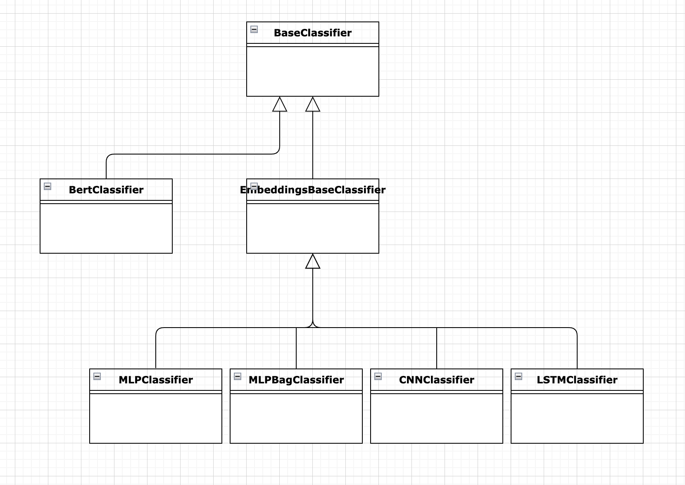
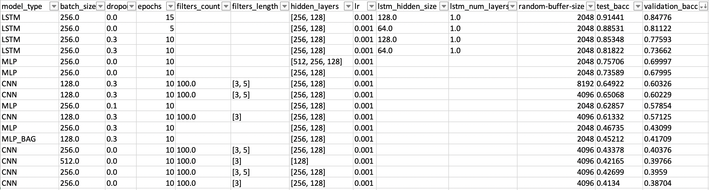
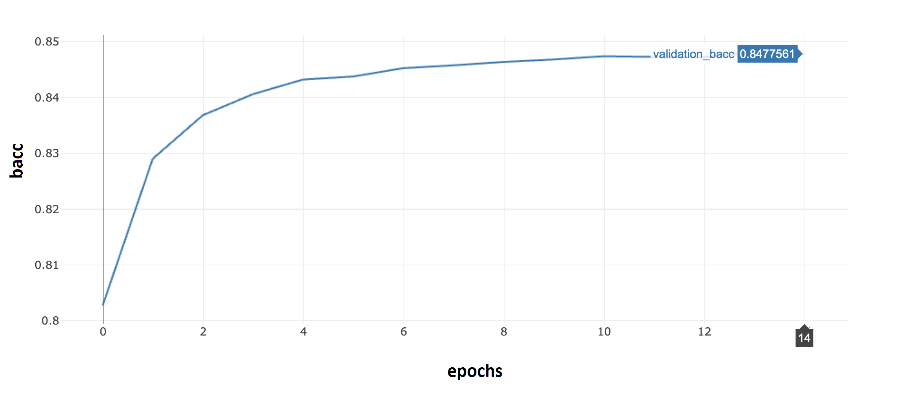
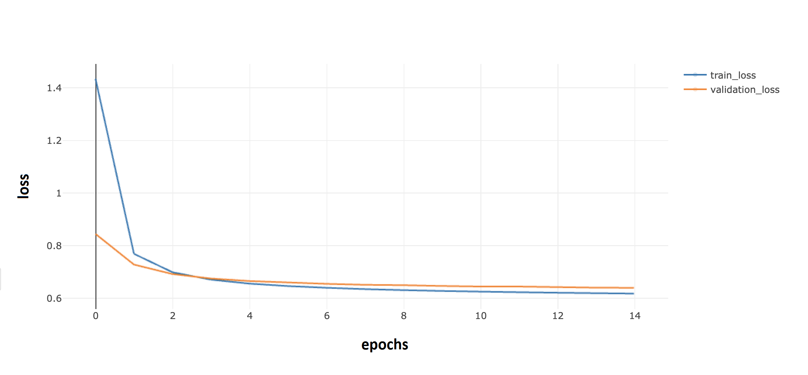
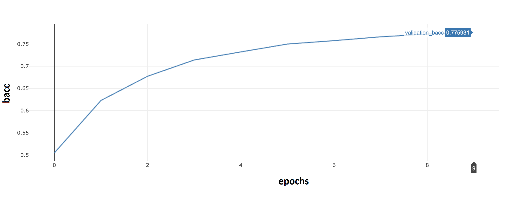
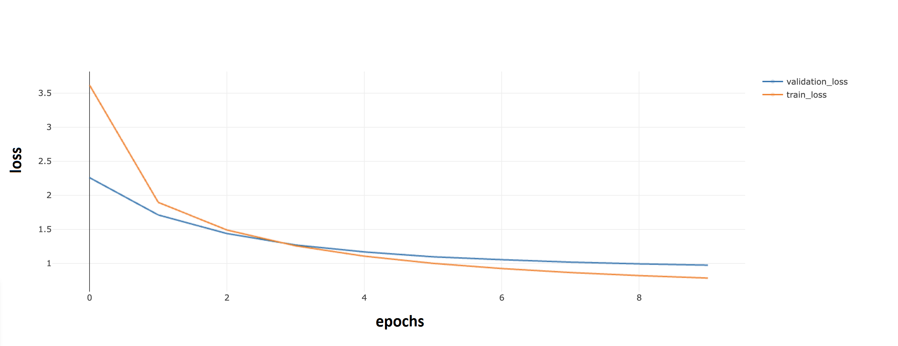
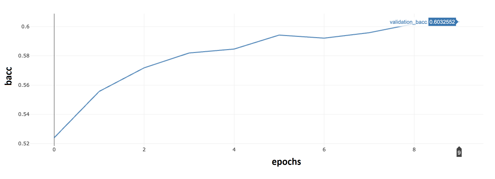
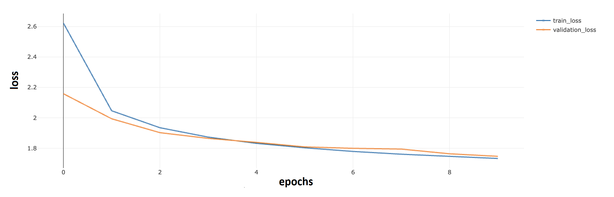
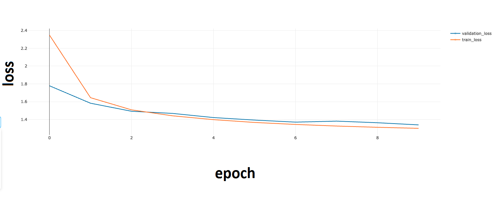
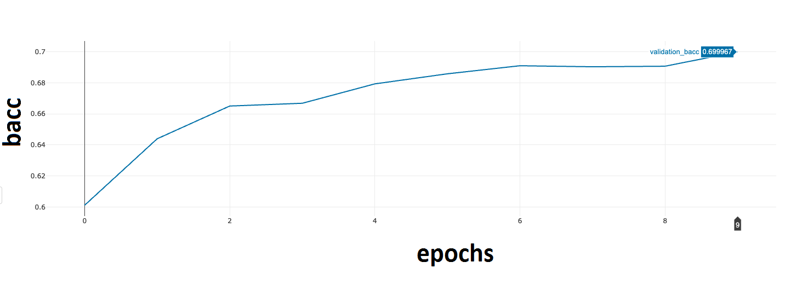

# Implementación

Se realizó la implementación de las siguientes redes:


MLP
RNN (LSTM)
CNN
Transformers (BERT)


En todos los casos, existe la posibilidad de configurar diferentes parámetros al momento de entrenara las redes. Para saber cuales son estos parámetros, por favor revisar los comentarios en **run_model.py**

Las redes MLP, RNN, CNN y BERT  heredan de la misma clase base **BaseClassifier**.  Esta clase ofrece una implementación por defecto del método forward el cual es utilizado por defecto por las redes MLP, RNN y CNN, pero es sobre escrito por la implementación BERT.

Las redes MLP, RNN y CNN, a su vez heredan de una clases común ** EmbeddingsBaseClassifier** (esta clases hereda de **BaseClassifier**). ** EmbeddingsBaseClassifier** implementan todo el tratamiento de embeddings.

Se muestra a continuación el diagrama de clases de la solución:



# Resultados de los entrenamientos


Para llevar a cabo el entrenamiento de las redes, se utilizó el dataset en español provisto en la materia. Además, no realizamos ningún tipo de procesamiento y limpieza de texto (es decir no realizamos ninguna tokenizacion, limpieza de stop words, stemming, lematazing, etc), sino que se utilizaron los datos provistos en el campo **DATA**. En este campo, se encuentra un listado de índices que corresponden a los embeddings del título del producto.


Debido a la no disponibilidad de Nabu, tuvimos que entrenar las redes de manera local. En el caso de la implementación BERT, no pudimos entrenar la red debido a la gran demanda de procesamiento. Queda pendiente correr BERT en una infraestructura con más poder de cómputo.

Como era de esperar, los mejores resultados que obtuvimos (descartado BERT), fueron mediante redes LSTM.

Los parámetros utilizados y los resultados obtenidos fueron los siguientes:





## LSTM

### LSTM mejor desempeño

El mejor desempeño (0.84776) lo obtuvimos,  aumentando el número de épocas (comenzamos con 5 y llegamos a 15) y bajando el dropout a 0. Se puede observar que a partir de la época 10, el bacc no cambia mucho.


### bacc contra dataset validación




### loss (train / validación)




### LSTM con dropout

Con un dropout de 0.3 también hemos tenidos buenos resultados (número de épocas que usamos es de 10), siendo el mejor desempeño usando este dropout de 0.77593. Se podrían utilizar un número mayor de épocas, pero por lo que se puede apreciar gráficamente, el bacc se va aplanando con lo cual la mejora no debería ser significativa. Hacemos foco en el uso de dropout puesto que el uso del mismo, hace más dificil que hagamos un overfitting.


### bacc contra dataset validación


### loss (train / validación)



Más allá de las apreciaciones visuales, creemos que sería conveniente correr nuevamente los entrenamientos en una infra con más capacidad de computo, aumentar el número de épocas, y aplicar un criterio de early stopping


##  Mejor CNN

Respecto a la performance de las redes CNN, no hemos tenido valores buenos. Hemos probado con diferentes hiperparametros, pero no hemos logrado superar un bacc de 0.60326. Decimos que los valores no son buenos, porque usando MLP hemos logrado obtener un bacc de 0.69997. En base a lo visto durante la materia, la CNN para este tipo de problemáticas debería tener un mejor desempeño que la MLP.

Entendemos que una limitante que tenemos para este caso en particular es el de no poder correr más épocas en las CNN. Además, sería bueno probar otros valores en los hiperparametros.

### bacc


Notar como el bacc sigue ‘creciendo’. Esto nos indica que entrenar durante más épocas permitiría mejorar el bacc

### loss



## Mejor MLP


### bacc contra dataset validación



### loss (train / validación)



# Como ver el detalle de los resultados de los entrenamientos


Corriendo mlflow ui, se pueden ver todos los experimentos realizados y los resultados de los mismos.

Dentro de la carpeta **practico**, correr

```
mlflow ui
```

# Como correr nuevos entrenamientos

- Crear el entorno virtual con las dependencias necesarias:

Antes de correr los modelos, se debe tener creado el env según lo indicado en **0_set_up.ipynb** (este notebook es provisto como parte del material de la materia)

- Activar el entorno

```
conda activate deeplearning
```

- Instalar wget

```
conda install wget
```

```
wget https://users.dcc.uchile.cl/~jperez/beto/cased_2M/pytorch_weights.tar.gz
wget https://users.dcc.uchile.cl/~jperez/beto/cased_2M/vocab.txt
wget https://users.dcc.uchile.cl/~jperez/beto/cased_2M/config.json
tar -xzvf pytorch_weights.tar.gz
mv config.json pytorch/.
mv vocab.txt pytorch/.
```

- Instalar BETO

https://colab.research.google.com/drive/1uRwg4UmPgYIqGYY4gW_Nsw9782GFJbPt#scrollTo=9KXo6-ahoJoM


- Ir a la carpeta **practico**

En la carpeta **practico** se debe crear una carpeta o un enlace con el nombre data. En data se debe tener la carpeta **meli-challenge-2019** (provista como parte de material de la materia) y el archivo **SBW-vectors-300-min5.txt.gz** provisto por la materia.

- Desde la carpeta **practico** se puede ejecutar:

   #### MLP

Ejemplo para correr de manera local y ver que el modelo ejecute (se limita a una sola epoc y 50000 samples)


```
python -m experiment.run_model --train-data ./data/meli-challenge-2019/spanish.train.jsonl.gz --test-data ./data/meli-challenge-2019/spanish.test.jsonl.gz --token-to-index ./data/meli-challenge-2019/spanish_token_to_index.json.gz --pretrained-embeddings ./data/SBW-vectors-300-min5.txt.gz --language spanish  --validation-data ./data/meli-challenge-2019/spanish.validation.jsonl.gz --embeddings-size 300 --hidden-layers 256 128 --dropout 0.3  --epochs 1 --train-max-size 50000 --validation-max-size 50000 --classifier MLP
```

Ejemplo entrenar con todos los samples

  ```
  python -m experiment.run_model --train-data ./data/meli-challenge-2019/spanish.train.jsonl.gz --test-data ./data/meli-challenge-2019/spanish.test.jsonl.gz --token-to-index ./data/meli-challenge-2019/spanish_token_to_index.json.gz --pretrained-embeddings ./data/SBW-vectors-300-min5.txt.gz --language spanish  --validation-data ./data/meli-challenge-2019/spanish.validation.jsonl.gz --embeddings-size 300 --hidden-layers 256 128 --dropout 0.3  --epochs 100 --classifier MLP
  ```

#### CNN


Ejemplo para correr de manera local y ver que el modelo ejecute (se limita a una sola epoch y 50000 samples)  

```
python -m experiment.run_model --train-data ./data/meli-challenge-2019/spanish.train.jsonl.gz --test-data ./data/meli-challenge-2019/spanish.test.jsonl.gz --token-to-index ./data/meli-challenge-2019/spanish_token_to_index.json.gz --pretrained-embeddings ./data/SBW-vectors-300-min5.txt.gz --language spanish  --validation-data ./data/meli-challenge-2019/spanish.validation.jsonl.gz --embeddings-size 300 --hidden-layers 256 128 --dropout 0.3  --epochs 1 --train-max-size 50000 --validation-max-size 50000  --random-buffer-size 4096 --cnn-filters-length 3 --classifier CNN
```

Ejemplo entrenar con todos los samples

```
python -m experiment.run_model --train-data ./data/meli-challenge-2019/spanish.train.jsonl.gz --test-data ./data/meli-challenge-2019/spanish.test.jsonl.gz --token-to-index ./data/meli-challenge-2019/spanish_token_to_index.json.gz --pretrained-embeddings ./data/SBW-vectors-300-min5.txt.gz --language spanish  --validation-data ./data/meli-challenge-2019/spanish.validation.jsonl.gz --embeddings-size 300 --hidden-layers 256 128 --dropout 0.3  --epochs 100 --random-buffer-size 4096 --cnn-filters-length 3 --classifier CNN
```

   #### RNN (LSTM)

Ejemplo para correr de manera local y ver que el modelo ejecute (se limita a una sola epoch y 50000 samples)  

```
python -m experiment.run_model --train-data ./data/meli-challenge-2019/spanish.train.jsonl.gz --test-data ./data/meli-challenge-2019/spanish.test.jsonl.gz --token-to-index ./data/meli-challenge-2019/spanish_token_to_index.json.gz --pretrained-embeddings ./data/SBW-vectors-300-min5.txt.gz --language spanish  --validation-data ./data/meli-challenge-2019/spanish.validation.jsonl.gz --embeddings-size 300 --lstm_hidden_size 64 --lstm_num_layers 1  --dropout 0.3  --epochs 1 --train-max-size 500000 --validation-max-size 500000 --classifier LSTM
```

Ejemplo entrenar con todos los samples

```
python -m experiment.run_model --train-data ./data/meli-challenge-2019/spanish.train.jsonl.gz --test-data ./data/meli-challenge-2019/spanish.test.jsonl.gz --token-to-index ./data/meli-challenge-2019/spanish_token_to_index.json.gz --pretrained-embeddings ./data/SBW-vectors-300-min5.txt.gz --language spanish  --validation-data ./data/meli-challenge-2019/spanish.validation.jsonl.gz --embeddings-size 300 --lstm_hidden_size 64 --lstm_num_layers 1  --dropout 0.3  --epochs 100 --classifier LSTM
```
