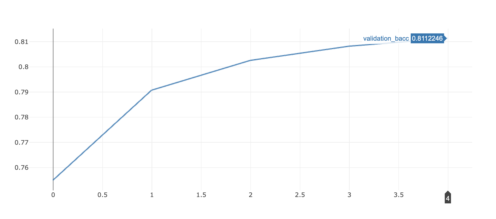
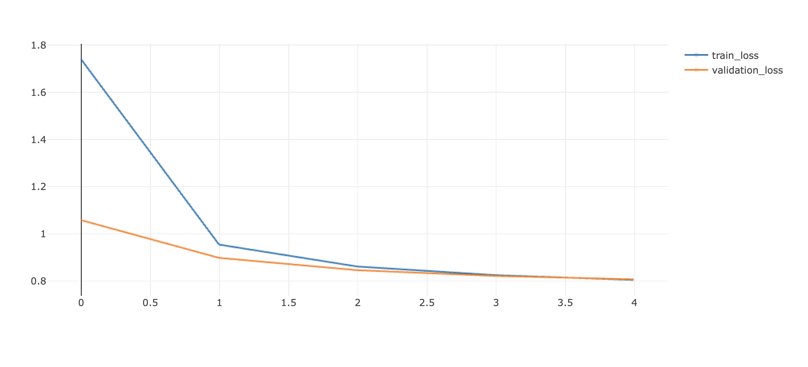

# Implementación

Se realizó la implementación de varios tipos de redes y arquitecturas:


MLP
RNN (LSTM)
CNN
Transformers (BERT)


En todos los casos, existe la posibilidad de configurar diferentes parámetros al momento de entrenara las redes. Para saber cuales son estos parámetros, por favor revisar los comentarios en **run_model.py**

Las redes MLP, RNN, CNN y BERT  heredan de la misma clase base **BaseClassifier**.  Esta clase ofrece una implementación por defecto del método forward el cual es utilizado por defecto por las redes MLP, RNN y CNN, pero es sobre escrito por la implementación BERT.

Las redes MLP, RNN y CNN, a su vez heredan de una clases común ** EmbeddingsBaseClassifier** (esta clases hereda de **BaseClassifier**). ** EmbeddingsBaseClassifier** implementan todo el tratamiento de embeddings.

Se muestra a continuación el diagrama de clases de la solución:


# Resultados de los entrenamientos


Para llevar a cabo el entremaniento de las redes, se utilizó el dataset en español provisto en la material. Además, no realizamos ningún tipo de procesamiento y limpieza de texto (es decir no se realizamos ninguna tokenizacion, limpieza de stop words, stemming, lematazing, etc), sino que se utilizaron los datos provistos en el campo **DATA**. En este campo, se encuentra un listado de índices que corresponden a los embeddings del título del producto. Este título previamente fue procesado y limpiado (tokenización, eliminación de stop words, stemming, lamtizing, etc)


Debido a la no disponibilidad de Nabu, tuvimos que entrenar las redes de manera local. En el caso de la implementación BERT, no pudimos entrenar la red debido a la gran demanda de procesamiento. Queda pendiente correr BERT en una infraestructura con más poder de cómputo.


Los mejores resultados que se obtuvieron, fueron por las redes RNN (LSTM).






Los gráficos anteriores fueron generados por medio de mlflow.

No obstante ello y debido a las limitaciones de capacidad de computo y tiempos, consideramos optimo correr nuevamente los entrenamientos utilizando una arquitectura acorde. Entendemos que la implementación BERT debería tener mejores resultados que los obtenidos por las redes RNN (LSTM).

Corriendo mlflow ui, se pueden ver todos los expriementos realizados y los resultados de los mismos.


# Como correr los entrenamientos

- Crear el entorno virtual con las dependencias necesarias:

Antes de correr los modelos, se debe tener creado el env según lo indicado en **0_set_up.ipynb** (este notebook es provisto como parte del material de la materia)

- Activar el entorno

```
conda activate deeplearning
```

- Instalar wget

```
conda install wget
```

```
wget https://users.dcc.uchile.cl/~jperez/beto/cased_2M/pytorch_weights.tar.gz
wget https://users.dcc.uchile.cl/~jperez/beto/cased_2M/vocab.txt
wget https://users.dcc.uchile.cl/~jperez/beto/cased_2M/config.json
tar -xzvf pytorch_weights.tar.gz
mv config.json pytorch/.
mv vocab.txt pytorch/.
```

- Instalar BETO

https://colab.research.google.com/drive/1uRwg4UmPgYIqGYY4gW_Nsw9782GFJbPt#scrollTo=9KXo6-ahoJoM


- Ir a la carpeta **practico**

En la carpeta **practico** se debe crear una carpeta o un enlace con el nombre data. En data se debe tener la carpeta **meli-challenge-2019** (provista como parte de material de la materia) y el archivo **SBW-vectors-300-min5.txt.gz** provisto por la materia.

- Desde la carpeta **practico** se puede ejecutar:

   #### MLP

Ejemplo para correr de manera local y ver que el modelo ejecute (se limita a una sola epoc y 50000 samples)


```
python -m experiment.run_model --train-data ./data/meli-challenge-2019/spanish.train.jsonl.gz --test-data ./data/meli-challenge-2019/spanish.test.jsonl.gz --token-to-index ./data/meli-challenge-2019/spanish_token_to_index.json.gz --pretrained-embeddings ./data/SBW-vectors-300-min5.txt.gz --language spanish  --validation-data ./data/meli-challenge-2019/spanish.validation.jsonl.gz --embeddings-size 300 --hidden-layers 256 128 --dropout 0.3  --epochs 1 --train-max-size 50000 --validation-max-size 50000 --classifier MLP
```

Ejemplo entrenar con todos los samples

  ```
  python -m experiment.run_model --train-data ./data/meli-challenge-2019/spanish.train.jsonl.gz --test-data ./data/meli-challenge-2019/spanish.test.jsonl.gz --token-to-index ./data/meli-challenge-2019/spanish_token_to_index.json.gz --pretrained-embeddings ./data/SBW-vectors-300-min5.txt.gz --language spanish  --validation-data ./data/meli-challenge-2019/spanish.validation.jsonl.gz --embeddings-size 300 --hidden-layers 256 128 --dropout 0.3  --epochs 100 --classifier MLP
  ```

#### CNN


Ejemplo para correr de manera local y ver que el modelo ejecute (se limita a una sola epoch y 50000 samples)  

```
python -m experiment.run_model --train-data ./data/meli-challenge-2019/spanish.train.jsonl.gz --test-data ./data/meli-challenge-2019/spanish.test.jsonl.gz --token-to-index ./data/meli-challenge-2019/spanish_token_to_index.json.gz --pretrained-embeddings ./data/SBW-vectors-300-min5.txt.gz --language spanish  --validation-data ./data/meli-challenge-2019/spanish.validation.jsonl.gz --embeddings-size 300 --hidden-layers 256 128 --dropout 0.3  --epochs 1 --train-max-size 50000 --validation-max-size 50000  --random-buffer-size 4096 --cnn-filters-length 3 --classifier CNN
```

Ejemplo entrenar con todos los samples

```
python -m experiment.run_model --train-data ./data/meli-challenge-2019/spanish.train.jsonl.gz --test-data ./data/meli-challenge-2019/spanish.test.jsonl.gz --token-to-index ./data/meli-challenge-2019/spanish_token_to_index.json.gz --pretrained-embeddings ./data/SBW-vectors-300-min5.txt.gz --language spanish  --validation-data ./data/meli-challenge-2019/spanish.validation.jsonl.gz --embeddings-size 300 --hidden-layers 256 128 --dropout 0.3  --epochs 100 --random-buffer-size 4096 --cnn-filters-length 3 --classifier CNN
```

   #### RNN (LSTM)

Ejemplo para correr de manera local y ver que el modelo ejecute (se limita a una sola epoch y 50000 samples)  

```
python -m experiment.run_model --train-data ./data/meli-challenge-2019/spanish.train.jsonl.gz --test-data ./data/meli-challenge-2019/spanish.test.jsonl.gz --token-to-index ./data/meli-challenge-2019/spanish_token_to_index.json.gz --pretrained-embeddings ./data/SBW-vectors-300-min5.txt.gz --language spanish  --validation-data ./data/meli-challenge-2019/spanish.validation.jsonl.gz --embeddings-size 300 --lstm_hidden_size 64 --lstm_num_layers 1  --dropout 0.3  --epochs 1 --train-max-size 500000 --validation-max-size 500000 --classifier LSTM
```

Ejemplo entrenar con todos los samples

```
python -m experiment.run_model --train-data ./data/meli-challenge-2019/spanish.train.jsonl.gz --test-data ./data/meli-challenge-2019/spanish.test.jsonl.gz --token-to-index ./data/meli-challenge-2019/spanish_token_to_index.json.gz --pretrained-embeddings ./data/SBW-vectors-300-min5.txt.gz --language spanish  --validation-data ./data/meli-challenge-2019/spanish.validation.jsonl.gz --embeddings-size 300 --lstm_hidden_size 64 --lstm_num_layers 1  --dropout 0.3  --epochs 100 --classifier LSTM
```
